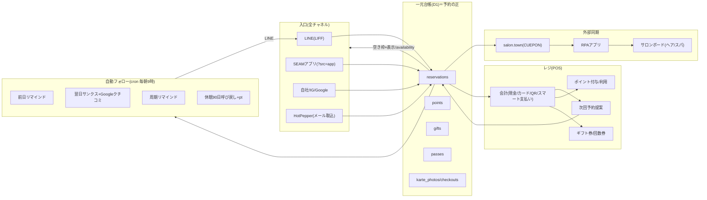

# SEAM 銀座 予約・POS エコシステム — 仕様書（画面 / 機能 / API接続 / 独自実装）

> 作成: 2026-07-25 ／ 最終更新: **2026-07-28**（次回予約・ポイント・ギフト券・回数券・スマート支払い・自動フォロー・紹介pt・ノーショー前金・カルテ写真・英語対応・アプリチャネルを追補） ／ 対象: `booking/`（顧客予約ページ＋店舗管理＋POS を1ファイルに同梱した SEAM 銀座 専用システム）
>
> **前提と責任の所在（エンジニア確認・2026-07-25）**
> - 現時点は **SEAM 銀座 単一テナント専用**。この構成のまま運用して問題ない。ただし設計・実装の責任は本システムの作者（AI）が持つ。
> - **将来、店子（他サロン）が増える際は CUEPON 側に統合**する。その時は **汎用性・セキュリティを最優先**とし、本システム側の都合（独自D1に寄せた実装など）は考慮されない。
> - よって本書は「今 SEAM 専用でどう動いているか」と「統合時に CUEPON API へ寄せる際の移行対象」を明確に分けて記録する。
> - 大原則（2026-07-16 エンジニア方針）: **`AI_API_REFERENCE` に実在する CUEPON API だけで作る／独自バックエンドに依存する機能は作らない／予約の“正”も CUEPON に置く**。本システムは予約はこれに準拠、**POS（会計・在庫・割引）は独自D1で先行実装しており、統合時に CUEPON ec系API へ移行する必要がある**（§6・§8）。

---

## 0. エコシステム全体図（2026-07-28 現在）

本システムは単機能の予約ページではなく、**「予約 → 来店 → 会計 → 次回予約 → 自動フォロー → 再来店」の顧客ライフサイクル全体を1つの台帳で回すエコシステム**である。

- **金流**: 現金/カード(Square)/QR＝店頭、スマート支払い＝HPB側決済(レジ現金不算入)、前金＝Square、ギフト券/回数券＝前受金。
- **HPBとの関係**: 新規獲得はHPBを併用しつつ、ポイント(HPB 2%徴収の代替)・次回予約・LINEフォロー・紹介ptで**再来店を自社台帳側に固定化**する設計。

## 1. デプロイ構成

| 層 | 実体 | 備考 |
|---|---|---|
| フロント | `booking/index.html`（単一HTML・顧客/管理 同梱） | GitHub Pages `suenotakemi-cloud/seam-website`（本番 `https://suenotakemi-cloud.github.io/seam-website/booking/index.html`） |
| API | Cloudflare Worker `seam-square-pay`（`booking/square/worker.js`＋`salon-bridge.js`＋`util.js`） | `*.workers.dev` |
| DB | Cloudflare D1 `seam-booking`（`booking/square/schema.sql`） | 独自バックエンド（統合時 CUEPON へ移行対象） |
| 秘密情報 | wrangler secret：`ADMIN_TOKEN`／`SQUARE_ACCESS_TOKEN`／`RESEND_API_KEY`／`LINE_CHANNEL_ACCESS_TOKEN`／`SALON_LOGIN_ID/PASS`／`LINE_LOGIN_CLIENT_SECRET` | コード非コミット |
| 公開変数 | wrangler.toml [vars]：**`ALLOW_ORIGIN`（CORS許可・★`https://seam.site` を含めること）**・`SQUARE_ENV`・`SQUARE_LOCATION_ID`・`SALON_HOST/SHOP_ID/SPA_SHOP_ID`・`LINE_LOGIN_CLIENT_ID` 等 | |

- **★CORSに本番ドメインが入っていなかった（2026-07-30修正）**：`ALLOW_ORIGIN` が github.io と localhost だけで、**本番配信の `seam.site` から予約が通らなかった**（preflightの Allow-Origin が別ドメインを返しブラウザが破棄）。`https://seam.site,https://www.seam.site` を追加。seam.site オリジンからのE2Eで予約作成→salon.town同期まで通過を確認。
- **顧客/管理の分岐はURLパラメータ**：`?src=`（line/google/instagram/own）付き＝顧客モード、無し＝管理モード。
- **管理モードは管理トークン認証必須**（§7）。顧客モードは PII を保持しない。

---

## 2. 画面仕様

### 2.1 顧客予約フロー（顧客モード `?src=`・SEAM世界観：白×ゴールド／スパはセージ）
1. **入口選択**：ヘアサロン / スパ（ヘッドスパ）の2択。以降そのセクションのメニューのみ表示（ヘア→ヘア店、スパ→スパ店へ振り分け）。
2. **メニュー選択**：クーポン13＋単品15。カテゴリ別。所要時間・税込価格表示。
3. **スタッフ選択**：指名なし（フリー）／各スタイリスト。
4. **日時選択**：営業時間・シフト・空き枠から。スマート割（隙間なく繋がる枠に特典）・最短予約。
5. **確認**：姓/名/セイ/メイ の4欄（HotPepper形式）・電話・合計・キャンセルポリシー。
6. **前金決済**（任意）：**Square Web Payments を実装（2026-07-30）**。
   - **★それまで前金画面はモックだった**：カード番号は `readonly` のテスト番号で `/pay` を一度も呼んでおらず、それでも予約に `deposit` が「受領済み」として記録されていた（＝1円も切られていないのに前金あり）。本番切替に先立って作り直した。
   - カード情報は **Squareのiframeに直接入り、当システムのサーバーは番号を受け取らない**（使い捨てトークンのみ）。3Dセキュア（`verifyBuyer`）に対応。
   - **決済が成功したときだけ予約を確定**する。失敗時は予約を作らず、理由を出して再入力できる。
   - アプリID/ロケーションID/SDKのURLは **`GET /pay/config`**（公開値のみ・アクセストークンは絶対に返さない）から受け取る。**サーバー設定だけで本番⇄テストが切り替わる**（HTMLの書き換え不要）。
   - **設定が揃っていなければカード欄を出さない**（「いまは事前のお支払いを承っておりません」＋店頭払いのみ）。嘘の前金記録を作らないため。
   - **サーバー側の保険**：`POST /reservations` は**決済IDが無いのに `deposit>0` なら 0 に落とす**（実測で確認済み）。`reservations.square_payment_id` に決済IDを保存＝手数料の突き合わせと返金の起点。
   - 必要な設定：`SQUARE_APP_ID`（公開値・[vars]）／`SQUARE_LOCATION_ID`（**本番はサンドボックスと別ID**）／`SQUARE_ACCESS_TOKEN`（**secret・オーナーが自分で登録**）／`SQUARE_ENV=production`。
   - **本番切替 完了（2026-07-30）**：`SQUARE_ENV=production` ／ `SQUARE_APP_ID=sq0idp-Hs1OE2-B0BMPzwPEEgF9dA` ／ `SQUARE_LOCATION_ID=LRKDJ0YV23GJZ`（**SEAM 銀座 サロン**）／本番アクセストークンはオーナーが secret 登録済み。`/pay/config` が `ready:true`、予約画面に Square の本物のカード欄（iframe）が出ることを確認。
   - **★旧 `SQUARE_LOCATION_ID=L4X65VRZXDMV7` は本番に存在しなかった**（サンドボックスのID）。**`GET /admin/square-check`（読み取りのみ・課金なし・CLEANUP_TOKEN必須）** で、同じトークンを本番/サンドボックス両方に投げて**どちらのトークンかを実測**し、本番の店舗一覧からIDを確定した。トークン自体は絶対に返さない。
   - **環境の食い違いを自動で止める**：`SQUARE_ENV` とアプリIDの向き先（`sq0idp-`=本番）が一致しないと `/pay/config` は `ready:false` を返し、カード欄を出さない。切替途中でお客様に壊れた画面を見せないため。
   - 管理画面「レジ・会計」に**前金の準備状況パネル**（環境／アプリID／店舗ID／要対応）を表示。
   - 同一Squareアカウントに他店舗のLocationも多数ある（札幌・名古屋・福岡・南堀江・銀座shop・免税など）。**前金と端末は「SEAM 銀座 サロン」に紐づける**。
7. **完了**：LINE友だち追加 ／ ホームケア（会員制オンラインショップ `seam.site/onlineshop`）導線 ／ Googleクチコミ導線。
- ログイン：LINE Login(LIFF)／Google（海外客）。確認はLINE/メールでサーバ送信（§7）。
- **多言語**：EN⇄日本語トグル（右上）。`?lang=en`／端末言語が日本語以外なら自動EN。方式=描画後DOM置換辞書（メニュー実名・スタッフ名はJP維持）。
- **チャネル**：`?src=` line/google/instagram/own/**app**（SEAMアプリのWebView埋め込み用）。LINEアプリ内はUA/liff.isInClient()で自動顧客モード。
- **ノーショー対策**：過去noshow履歴のある電話番号は「前金なしで予約」を非表示（`GET /precheck` PIIレス照会）。
- **★お名前はサロンボードに入る形しか通さない（オーナー指示 2026-07-30）**：`POST /reservations` に**サーバー側ゲート**（`checkNameParts`／`checkNameJoined`）。**予約を作るどの経路でも同じ規則が効く**（顧客予約／管理の手動登録／次回予約／将来のアプリ）。
  - **直せるものは黙って直す**：前後の空白／全角スペース区切り／連続空白／全角英数／半角カナ／ゼロ幅文字／ひらがな→カタカナ／電話の全角数字。例「`  山田   花子 `」→「`山田 花子`」
  - **直せないものは通さない**：1語だけ／空白2つ以上（3語）／姓の欄にフルネーム／記号・数字・絵文字／カナがカタカナでない／16文字超
  - **内部の空白は黙って詰めない**（「山田 太」を「山田太」にすると別人としてサロンボードに登録されるため、弾いて直してもらう）
  - **画面側にも同じ規則**（`nameGate`＝worker の `checkNameJoined` と同一ルール）。管理の手動登録・次回予約でも送信前に止める
  - **サーバーが弾いたら台帳から取り消す**：以前は localStorage に先に積んでいたため、サーバーが400で拒否しても**画面上は登録済みに見えていた**（＝入っているつもりで入っていない）。拒否時は行を消して理由をトースト表示する
  - 運用ツール：`POST /admin/purge-test?ids=r...,r...` で誤登録を**D1とsalon.townの両方から**掃除（孤児ミラーも `/salon/noname` で確認）
- **入口の判断材料（2026-07-30・外部レビュー反映）**：ヒーロー直下に細い4枠（料金の目安=カット¥9,900/カラー¥9,900〜/ヘッドスパ¥12,000〜・所要45分〜2時間・カウンセリングの時間つき・対応言語）。**詳細を増やさず判断材料だけ補う**方針。サービスカードに情緒コピー1行（ヘア「今日そのまま出かけたくなる髪へ」／スパ「根元から軽くなって、頭がほどける時間」）。カードの下に**不安を消す一言**（「メニューは施術前に一緒に確かめますので、今ここで決め切らなくても平気です」＝「今ここで決め切らないといけないのでは」という最大の不安への回答）と、**髪格診断への細い導線**（迷っている方向け・主CTAより下に置く）。
- **日本語以外のときだけ出す安心の先回り**：英語で対応できます／日本語のお電話は要りません／施術前にプランを一緒に確認します。**海外の方が最初に知りたいのは料金より「言葉が通じるか」**のため、料金枠より上に出す。

### 2.2 管理画面（管理モード・トークン認証後）
ヘッダー nav：**今日 / ダッシュボード / 予約台帳 / 顧客カルテ / レジ・会計 / 売上レポート / 商品・在庫 / シフト / 予約ページ / チャネル連携**＋ログアウト。

| タブ | 内容 |
|---|---|
| 今日 | スタッフ別の当日予約リスト（次客が上）・ステータス変更・詳細 |
| ダッシュボード | KPI（今日/今週予約・稼働率・自社比率）・**本日の売上パネル**・**予約リマインド状況**・要ブロック・キャンセル待ち・再来おすすめ・チャネル内訳 |
| 予約台帳 | スタッフ×時間の単日マスタ表・空き枠クリックで登録・予約クリックで詳細/カルテ/会計 |
| 顧客カルテ | 顧客一覧（LTV順）・**LTV（会計実績）/会計回数/平均単価**・来店履歴・施術メモ・**施術写真(before/after・カメラ撮影→自動圧縮→拡大/削除)** |
| レジ・会計 | **💇サロン／🛍ショップ の切替**（端末ごとに記憶）・お会計・本日の売上・未会計/会計一覧・**レジ締め**・Squareターミナル設定・**自社ポイント設定(ON/OFF・還元率0-20%)**・**🎁ギフト券発行/一覧/無効化/券面印刷**・**🎫回数券パス発行/一覧/無効化** |
| 売上レポート | 期間別・日別・スタッフ別（指名率）・**月間目標/前年同月比/歩合給**・CSV書き出し・**スマート支払い列(HPB入金)** |
| 商品・在庫 | **店舗の選択（端末ごと）**・商品の**検索**（5000点なので一覧は出さない）・**1商品の全店在庫**（±で手直し）・**🚚店舗間の在庫移動**・**📦棚卸し**・**📥CSV一括取り込み**・入荷履歴 |
| シフト | 営業時間11:00–20:00・不定休・サロン休業日/スタッフ個別休み（日付指定）・スマート割/お礼の率 |
| 予約ページ | 顧客フローのプレビュー |
| チャネル連携 | 各媒体の接続方式の案内・予約リンク生成・メール取込シミュレータ |

### 2.3 カウンセリングシート・同意書（店頭 iPad／`booking/counseling.html`・2026-07-30）
来店直後にiPadで記入してもらう独立ページ（管理画面とは別URL・noindex）。全7セクション・上下スクロールのみ（ページ送りなし＝高齢の方でも迷わない）。
1. **お客様について**：お名前（必須）／**電話番号（必須・2026-07-30）**／お誕生月
2. **今日のご希望**：ヘア⇄ヘッドスパ切替。悩みチップ（複数可・ヘア9種／スパ8種）＋なりたいイメージ自由記入
3. **これまでの施術**：ブリーチ／黒染め／ヘナ／パーマ／縮毛矯正／セルフカラー等（複数可）→**該当時は薬剤リスクの注意文を自動表示**、最後の施術時期
4. **お体のこと**：妊娠中・授乳中／アレルギー／皮膚疾患／通院中 等（複数可）＋**⚠自由記入（アレルギー・薬剤NG）**
5. **おうちでのお手入れ**：使用シャンプー・アイロン頻度・お困り（→店販提案の材料）
6. **ご確認とご同意**：7項目（仕上がりの個人差／薬剤リスク／健康状態の申告／貴重品／キャンセル料率／**音声AIカウンセリング**／**個人情報の取り扱いと保管**）→**同意チェック必須**（未チェックはサーバ側でも400で拒否）。続けて**用途別の任意同意**を3ブロック（店舗設定で出し入れ）
   - **📷 写真**：撮影しない／カルテ用だけOK（外に出さない）／SNS・HP・広告もOK の3択＋「お顔が写らないように」（SNS選択時のみ）
   - **🎥 動画**：撮影しない／記録用だけOK／SNS・広告もOK の3択（リール・ショート想定）
   - **🎙 音声AIカウンセリング**：使ってOK／使わないで（＝スタッフが手で記録）。**端末・環境によって精度に差が出るため既定OFF＝実際に使う店だけON**。OFFのときは同意本文の項目自体も出ない（6項目→ONで7項目）
   - 一括同意にしない理由＝「カルテ用はOKだがSNSは嫌」が実際に多く、美容師が撮る前に可否を判断できる必要があるため。**可否は毎回その日の意思で上書き**（前回OKでも今回NGならNG）
7. **ご署名**：指またはペンで手書き（canvas・PNG化して保存）

**同意文の読ませ方（2026-07-30）**：各項目を「見出し → **要点1行（太字）** → 補足（小さめ）」の3段にした。内容は減らさず、読み終えやすさだけを調整（安全説明を法律文書ではなくホスピタリティとして見せる）。要点7本は5言語すべてに訳あり。

**★写真・動画の同意は既定を「未選択」にする（2026-07-30・外部レビュー反映）**：以前は写真の既定が `karte`（カルテ用OK）だった＝**お客様が選んでいない同意を記録していた**。これは同意として成立しないため修正。
- クライアントは未選択のままでは提出させない（「お写真についてお選びください」）
- Workerも**未選択を `karte` に丸めない**（空のまま保存）。集計は `unset` として別に数える
- カルテのバッジは未選択を「📷 未選択・撮影前に確認」と出す（勝手にOK扱いしない）
- 見出し直下に「撮る前に必ずお声をかけます。あとからいつでも変えられます」を置いて圧を下げる

**★スタッフの初期設定は顧客画面に出さない（2026-07-30・外部レビュー最優先指摘）**：`counseling.html` 末尾に「管理トークンを入力」欄が出ていた＝お客様に内部設定が見える状態で、意味が分からなくても不安にさせる（高級感と信頼感の毀損）。
- **専用URL `counseling.html?setup=1` のときだけ描画**（顧客URLでは**DOMにも作らない**）
- 管理画面の「シートに出す項目」の下に、そのURLと「この端末で開く ↗」を置いた（新しいiPadを使うときだけ使う）

- 入口：`counseling.html?name=&phone=&kind=hair|spa&from=admin`（**受付の来店処理から、または顧客カルテの「iPadで記入してもらう ↗」から氏名・電話・種別を引き継いで開く**＝スタッフが打ち直さない）
- **受付導線（2026-07-30）**：予約詳細で「来店済みにする」を押すと、そのまま「📝 シートを渡す／あとで」の確認が出る。渡す＝同じタブでシートを開くのでiPadをそのままお客様へ。同じお客様には同じ日に二度出さない。`from=admin` のときは完了画面に「受付の画面にもどる」が出る
- 初回のみ**スタッフの初期設定**カードで管理トークンを入力（実際にAPIへ通るか検証してから端末に記憶・以降非表示・印刷時も非表示）
- 印刷：記入済み＝選んだ項目のみ（4ページ）／白紙のまま押した場合＝選択肢を残した**手書き用シート**（6ページ）として出力
- 提出後の反映：カルテの「カウンセリングシート・同意書」に日付／ヘア・スパ／⚠注意／ご要望／選択項目を最新3件表示。**⚠自由記入は顧客の重要メモへ自動マージ＝予約詳細の先頭に赤字警告として出る**（施術前に必ず目に入る）
- **撮影可否バッジ**：写真・動画・音声AIの可否を `customer_notes` に保存し、**カルテと予約詳細の両方にバッジ表示**（📷撮影NG＝赤／カルテ用だけOK＝グレー／SNS・広告OK＝緑・顔なし注記／🎙AI録音NG＝赤）。席に着く前に見える位置に置く
- 重要メモの手編集（`POST /custnotes`）では写真・音声の同意を**上書きしない**（お客様の意思表示なのでスタッフ操作で消えない）

### 2.3.0 多言語（5言語・ワンタッチ切替・2026-07-30）
海外のお客様のカウンセリングをその方の言葉で行うための仕組み。予約ページと同じ **日本語 / English / 简体中文 / 繁體中文 / 한국어**。
- 辞書は **`booking/cs-i18n.js`（独立ファイル・167語）**。iPadのシートと管理画面の**両方から同じ辞書を読む**
- 切替はヘッダーのボタンでワンタッチ。`?lang=` 指定／端末の言語から自動判定／この端末の前回選択を記憶
- **★保存されるデータは常に日本語**：チップの `data-v` は日本語のまま（見える文字だけ訳す）。だから担当者はいつも日本語で読め、カルテも集計もCSVも言語に関係なく動く
- 自由記入は**お客様の言葉のまま残し、日本語の下訳を並べて付ける**（2026-07-30追加・下記）。カルテに「English で記入」バッジと注記を出す

#### 自由記入の日本語下訳（Workers AI・2026-07-30）
海外の方の自由記入が読めないまま残るのを防ぐ。とくにアレルギー欄が読めないのは危険なため。
- **Workers AI**（`[ai] binding = "AI"`／`@cf/meta/llama-3.3-70b-instruct-fp8-fast`）。**外部APIキーを預からない**ので鍵がブラウザやiPadに渡らない。提出時に一度だけ訳して保存（`answers.wantJa`／`answers.cautionJa`）。
- **★赤い警告（`customer_notes.caution`）に機械翻訳は入れない。** 実測で下記の事故が出たため、警告文は**お客様の原文＋「（外国語の記入・要確認）」**とし、下訳はシート側に持ってカルテで原文と並べて「機械翻訳・要確認」つきで見せる。
  - 実測した壊れ方：①`bleached twice`→「二度毛染めをしました」（ブリーチが毛染めに化ける） ②`염모제 알레르기`→「パーマのアレルギー」（染毛剤が消える） ③出力が意味不明な文字列に崩壊 ④中国語がそのまま返る ⑤ロシア語が混入
- **出力の健全性チェック**（通らなければ下訳を付けない＝偽の下訳を出さない）：かなを含む／長い英字の連なりが無い／英字比率25%未満／キリル・ハングル・アラビア・タイの混入が無い／長さが原文の0.3〜3.5倍／**原文の8文字以上をそのまま抱えていない**（「原文＋です」で通り抜けるのを防ぐ）。1回だけやり直して、それでもだめなら付けない。
- **施術名の対訳表をプロンプトに渡す**（ブリーチ／染毛剤／パーマ／縮毛矯正／トリートメント、かゆみ／腫れ／発疹／妊娠中）。これで韓国語の「염모제→パーマ」誤訳が「染毛剤」に直った。
- **残る限界**：文としては自然でも意味がずれる誤訳は機械的に検出できない。だから**安全に関わる事実は日本語で保存される選択肢（お体のことのチップ）が担い**、自由記入の下訳はあくまで下訳。カルテにも「必ずご本人に確認してください」と出す。
- 言語を切り替えても**入力・選択・署名は消えない**（`keep()`→再描画→署名は `S.sign` から復元）
- 同意文（7項目すべて）も全言語。**同意は理解できる言葉で取らないと意味がないため、長文も省略せず訳す**
- **管理画面側もワンタッチ**：カルテのシート欄に「English で表示 ⇄ 日本語で表示」ボタン（そのお客様の言語のシートがある時だけ出る）。画面を見せながら説明できる
- シートに `lang` を保存し、集計に「記入された言語」の内訳を出す（接客体制の判断材料）

### 2.3.1 お待ちの間の髪格診断（seam.site/finder 連携・2026-07-30）
待ち時間を「診断の時間」に変える導線。**シートは先に提出して終わらせ、そのあと任意で診断**（シートの途中に長い診断を挟むと止まるため）。
1. シート提出 → 完了画面に「お待ちの間に、もうひとつ／髪格診断をはじめる（3分ほど）」＋「任意です。途中でやめても大丈夫です」
2. タップ → **同じ画面の中に全画面 iframe で `/finder?src=salon` を開く**（別タブにしないのでお客様が迷子にならない。`X-Frame-Options: SAMEORIGIN` なので同一オリジンで埋め込み可）
3. 診断完了 → finder が `localStorage['seam_karte_last']` に結果を書く → シート側が1.5秒ごとに監視して検出
4. `POST /counseling/attach` で**提出済みシートに後から紐付け**（スタッフの手を介さない）→ 完了画面に「診断の結果を担当者にお届けしました／髪質タイプ・ダメージ・目的」を表示
- **共有iPadの取り違え対策（重要）**：①診断を開いた時刻より新しい `savedAt` だけ採用＝前のお客様の結果を拾わない ②紐付け後に `seam_karte_last` を端末から**消す**
- 保存形：`answers.finder = {typeId,typeName,damageTier,originName,mainGoalName,radar,savedAt}`
- 反映先：カルテのシート表示に「髪格診断 ○○タイプ／ダメージB／ツヤ」、集計に髪質タイプ・ダメージ・目的の内訳と実施率
- finder 側は**無改造**（localStorage を読むだけ）。診断の主役はケア＋ショップ導線という位置づけを崩さない
- スパのお客様も**髪格診断のまま**（`/skinfinder` には切り替えない・オーナー判断 2026-07-30）
- **★診断とかぶる質問はシートで聞かない（2026-07-30）**：半年以内の髪格診断がある方は、シートを開いた時点で `GET /counseling?key=電話` から検出し、診断が聞いている項目を省く（7節→6節）。
  - 省くもの：今日のご希望のチップ（診断の concerns/goal と重複）・これまでの施術（bleach/color/perm/straighten）・頭皮の状態（scalpType）・おうちでのお手入れ（items/tools/heatProtect）
  - **省かないもの**：お体のこと（診断は医療系を一切聞いていない）／**ヘナ**（finderに項目が無い＝薬剤の相性に関わるので必ず聞く。「ひとつだけ確認させてください」として1問だけ出す）／同意／署名／今日のご要望の自由記入（今日固有の話なので残す）
  - 黙って減らさない：先頭に「✓ 髪格診断の結果をお預かりしています／診断で伺った内容は、この用紙では重ねてお聞きしません」＋診断の要約を出す
  - 半年より古い診断は省略に使わない（髪の状態が変わっているので聞き直す）

### 2.3.2 顧客データのまとめ（`GET /customer/profile`・2026-07-30）
散らばっていた情報を1人分1枚に集約する。カルテを開くと最上部に出る「**この方のまとめ**」。
集約元：予約履歴／会計・LTV／カウンセリングシート（全枚数を統合）／髪格診断／撮影・音声AIの同意／⚠重要メモ／ポイント／回数券／写真枚数。
- ⚠注意は**重要メモとシートの自由記入の両方から拾って重複を除く**（見落としを作らない）
- 選択項目は複数シートを**マージ**（前回はブリーチと書き、今回は書かなかった、で消えない）
- ご要望は原文＋日付＋言語で最新2件
- 右上の「書き出す」で1人分のCSV（項目／ご要望原文／来店履歴）＝引き継ぎと持ち出し用
- **★本人の見分け方＝電話番号（オーナー方針 2026-07-30「電話番号は必須にしましょう。そしたら同姓同名だとしても間違わない」）**
  - シートは**電話番号必須**（数字8桁以上・全角で打たれても半角化して受ける）。サーバ側でも400で拒否。`counseling.key` は常に電話＝`n:氏名` キーは新規で作られない
  - 氏名キーだった `checkouts`／`passes`／`karte_photos` に **`phone` 列を追加**し、POS側から電話を書き込む。読み出しは**電話一致が優先**、電話を持たない古い行だけ氏名で拾う
  - **同姓同名がいる場合は氏名フォールバックを無効化**する。電話の無い古い行はどちらの人か決められないため、誤って両方に足さない（ローカルsqliteでSQLの挙動を検証済み）。黙って落とさず、まとめ枠に「同じお名前の方が他に○人／電話が入っていない古い会計○件はこの集計に含めていません」と表示
  - まとめ枠に `sameName`（同姓同名の人数）と `legacyUnlinked`（決められない古い記録の件数）を出す
  - 統合時はCUEPONの `account_id` 一本に寄せる（電話はその名寄せキーとして使う）

### 2.4 カウンセリング集計（管理タブ「カウンセリング」・2026-07-30）
毎月のミーティングにそのまま使える集計画面。`GET /counseling/stats?from&to&kind` をWorker側で集計（テスト名は除外）。
- KPI：シート枚数／一番多いお悩み／SNS・広告OK率／音声AI OK率
- 期間（今月・先月・過去1年・任意）×対象（ヘア＋スパ／ヘアのみ／スパのみ）
- **お悩み・ご希望**／**これまでの施術**／**お体のこと**／**おうちでのお手入れ** を横棒＋件数＋比率
- **お客様のことば**＝自由記入の頻出語（カタカナ語・漢字語を2〜8文字で抽出し助詞を除去。ホバーで実際の文）
- **書いてくださったこと（原文）**＝ミーティングでそのまま読める引用リスト（最新25件）
- **撮影・音声AIの同意**＝写真／動画／音声AIの実態内訳＋「顔が写らないように」件数
- 月ごとの枚数推移／**CSV書き出し**（集計＋原文）
- 同じ画面に **⚙ シートに出す項目（この店舗の設定）**＝写真・動画・音声AIの各ブロックをON/OFF（`settings.csPhoto/csVideo/csVoice`・**既定は写真ONのみ**＝動画と音声AIは環境差があるため使う店だけON）。iPadシートは起動時に `GET /settings` を読んで反映

---

## 3. 機能仕様（要約）

- **予約**：作成/変更/キャンセル/削除、ステータス（booked/done/cancelled/noshow）、ダブルブッキング判定、キャンセルポリシー段階課金、ノーショー損害上限、キャンセル待ち自動連絡、スマート割（隙間解消）。
- **兼任スタッフ相互ブロック**：ANZU はヘア/スパ兼任。ヘア予約→スパに「予定」、スパ予約→ヘアに「予定」（ダブルブッキング防止）。ヘア/スパで別 account（`cu`/`cuSpa`）・別店舗（`SALON_SHOP_ID`/`SALON_SPA_SHOP_ID`）へ振り分け。ミラーは salon.town の account_link が自動生成。
- **営業時間/休日**：11:00–20:00・不定休（減算モデル＝全員毎日出勤ベース、休みは日付指定で引く）。
- **★レジはサロン用とショップ用に分ける（オーナー方針 2026-07-30）**：予約・サロンとショップはレジを分け、**切り替えられる**形にした。
  - モードは**端末ごとに記憶**（受付のiPadはサロン、ショップのレジはショップに固定できる。毎回切り替えなくていい）
  - **ショップモード**：技術欄と指名を出さず、バーコードのスキャンと明細が主役。在庫が減る
  - **ショップのレジを実運用向けに（2026-07-30）**：**同じ商品を続けて読んだら行を増やさず個数を足す**（1個ずつ行が伸びると見づらい）／個数の変更・行削除／**現金のお預かりとお釣り**（¥1,000・¥5,000・¥10,000・ちょうど のボタン／足りないときは「あと¥○○」）／**商品はサーバー側で検索**（手元に無ければバーコードで引く）
  - **サロンモード**：従来どおり（予約からの会計・カルテ・次回予約・指名）
  - **会計に `mode` を保存**（`salon`/`shop`）。**レジの当日一覧とレジ締めはモードごとに分かれる**＝それぞれのレジの現金が合う
  - **Squareの店舗と端末もモードで切り替わる**：サロン=`SQUARE_LOCATION_ID`（SEAM 銀座 サロン）／ショップ=`SQUARE_LOCATION_ID_SHOP`（SEAM 銀座 shop）。端末IDも別に保持（`terminalDeviceId` / `terminalDeviceIdShop`）
  - 売上レポートは合算に加えて**サロン／ショップの内訳**を出す
- **レジ・会計**：お会計（技術＋店販＋割引・支払方法 現金/カード/QR・指名/フリー）、バーコード店販＋在庫自動減算、本日売上、レジ締め（釣銭準備金→理論残高→実査→過不足、前日繰越）。
- **売上レポート**：期間/日別/スタッフ別（客単価・指名率）、月間目標（達成率・着地見込み）、前年同月比、歩合給（指名技術/フリー技術/店販に率）、CSV。
- **商品・在庫・仕入**：商品マスタ、在庫、入荷履歴（仕入原価）。
- **★1商品に複数のJAN／重複商品の統合（2026-07-30）**：リニューアルで旧JANと新JANが並ぶため、`products.alt_barcodes`（`,JAN,JAN,` 形式）に複数持たせ、**どちらを読んでも同じ商品として数える**。バーコード引きは主バーコード（索引つき）→ 追加JAN の順（レジのスキャンと棚卸しの両方）。
  - **統合は削除しない**：残す側にJANを寄せ、消す側は `active=0` ＋ `merged_into` を記録（戻せる）。在庫が入っていれば残す側へ寄せる。`POST /admin/merge-products`
  - **★機械的に消すと事故る**（実測で判明）。表記をそろえた重複47組のうち、**統合して安全なのは19組だけ**（アイテム一覧とSquareが1対1・価格も同じ＝表記ゆれのみ）。残り28組は**名前が同じでも別商品**：香り4種類（フプの森 アロマミスト）・色3種類（ファンデーション コンプリートハーモニー）・サイズ違い（パイウェイ ミストエクストラ ¥8,800/¥2,200/¥3,520）・詰替（メラノショット 付替用）。**触らずに一覧を出してオーナー確認に回す**（`要確認_同名の商品.tsv`）。棚卸しで読み取れば数字で分かるため急がない
  - 実測：19組＋(COPY)行1件を統合 → 有効な商品 5,020点（統合して無効化20件）。旧JAN・新JAN両方でスキャン・棚卸しが通ることを確認
- **★店舗ごとの在庫（2026-07-30・オーナー要望）**：`products.stock` の1本値から **`stock_by_shop`（店舗×商品×数量）** に移した。
  - 店舗：`ginza` / `sapporo` / `nagoya` / `fukuoka` / `horie` の5店（`shops` テーブル・Squareの店舗IDを紐付け）
  - **★免税（SEAM GINZAショップ免税 `L356YMPP0J4R9`）は銀座と同じ商品を扱うため、在庫は銀座と一体**（Square店舗は2つ／在庫はひとつ）。オーナー確認済み
  - **棚卸しは店舗を選んで行う**（`stocktakes.shop_id`）。差分も確定もその店舗の在庫と比べる
  - **1商品の全店在庫を一覧**（`GET /stock/product`）＝「札幌にございます」と即答できる
  - **★店舗間の在庫移動**（`POST /stock/move`）：出す店から引いて入れる店に足し、`stock_moves` に記録（誰が・いつ・何を・何個）。**出す店の在庫が足りなければ止める**（マイナスにしない・`force:true`で上書き可）。同じ店舗への移動も止める。実測で確認済み
  - 在庫の手直しは `POST /stock/adjust`（店舗指定・`stock_adjust` に記録）
  - **画面（2026-07-30）**：商品・在庫タブの最上部に**店舗の切替**（端末ごとに記憶＝銀座のiPadは銀座）。**商品は検索で探す**（5,000点を一覧に並べない・バーコードを読めば1件引き）。商品をタップすると**全店の在庫が並び**、その場で±で直せる。「🚚店舗間で在庫を移す」を開くと、商品を読んで出す店・入れる店・個数を決めて移せる（直近の移動履歴つき）
  - **★会計・入荷の在庫増減もサーバーの店舗別在庫に切り替えた**（以前は手元の1本値を書き換えていたので、店舗別にすると合わなくなる）
  - 既存の1本値は初回に**銀座の在庫として移す**（移行の取りこぼしを作らない）
- **★棚卸し（2026-07-30・商品5000点規模を想定）**：ショップの棚卸しがSquare POSでは大変というオーナー要望。
  - **現場は読むだけ**。同じ商品を2回読めば2個。**数えている間は理論在庫を画面に出さない**（見えていると「合わせにいってしまい」実数が取れないため）
  - **数はサーバーに置く**（`stocktakes`/`stocktake_counts`）→**中断・再開できる／複数の端末で同時に数えられる**
  - 数え終わってから**ズレた商品だけ**を出す（合っていたものは件数のみ）。一度も読めなかったもの（在庫があるのに読めていない＝紛失の可能性）も別枠で出し、**「棚に無いと確認した場合だけ0にする」**チェックを明示的に置く
  - 差分画面で実数を直せる（数え間違いの訂正）。確定すると在庫を実数にして **`stock_adjust` に増減の記録を残す**（いつ・誰が・どれだけズレたか）
  - 登録の無いバーコードを読んだら、その場で商品登録に飛べる
  - **静かに失敗させない**：スキャンが通らなかったら赤で記録し「読めなかった」件数を出す（読んだつもりで数えられていないのが一番危ないため）
  - API：`POST /stocktake`（開始・開いていれば再開）／`POST /stocktake/scan`（1スキャン＝1往復・サーバーでバーコードを引いて+1）／`POST /stocktake/set`（訂正）／`GET /stocktake/diff?unscanned=1`／`POST /stocktake/commit`（`zeroUnscanned`）／`POST /stocktake/cancel`／`GET /stock/adjust`
- **★Square商品台帳の取り込み（2026-07-30・ショップを自作POSへ移すため）**：`POST /admin/square-catalog`。
  - **★名前と価格はアイテム一覧（メーカー正規＝salon.townと同じ）を正とする**（オーナー方針 2026-07-30）。Squareは商品名の表記がsalon.townと違うため、**Squareの名前と価格は取り込まない**。
  - **JANは名前が違っても正しい**ので、**JANを突き合わせの鍵**に使う。突き合わせは Squareの商品ID → **JAN(GTIN)** → SKU(メーカー品番) の順。**名前での突き合わせはしない**（表記が違うのが前提＝誤って別商品に結び付く）
  - JANが一致した商品は `sq_id` と、空だったバーコード／メーカー品番だけを埋める（名前と価格は据え置き）
  - アイテム一覧に無い商品（棚にはあるが正規リスト外）は `source='square'` として登録し、棚卸しで数えられるようにする
  - **実測（2026-07-30）**：商品 4,257 → **5,042点**（JANで一致1,079件・Squareにしか無い785件）。**Square POSで売れた明細が結び付く率 42.4% → 97.0%** に改善。JANも価格も無い行（`paypay`・`ミニサイズ`）は `active=0` にして棚卸しの対象外にした
  - **★1回で全部読むと上限に当たる**ため1ページ（100件）ずつ処理し、次の `cursor` を返して呼び出し側が繰り返す
  - **★ページをまたぐと親の商品名が引けなくなる**（バリエーションと商品が別ページに来る）ので**2段構え**にした：`phase=items` で商品名を `sq_items` に控え、`phase=vars` でバリエーションを入れる
  - 対象店舗を絞れる（既定＝ショップ＋免税）。他店舗の商品を混ぜない
  - バーコードとメーカー品番は**空のときだけ埋める**（既にある値を壊さない）
- **salon.townからの価格自動更新は現状できない（実測 2026-07-30）**：`/get/ec/item` を10通りの形で試したが、**SEAMのshop_idで見えるのは予約メニューだけ**（SEAMカット¥9,900等）。物販4,257点は別の範囲にあり `filter.id`／`company_id`／`maker_id`／`code` はいずれも0件（`filter.id`が黙って無視されるのは既知の癖）。**価格改定時はアイテム一覧CSVを入れ直す**（商品IDで突き合わせ・在庫は触らない・4,257点で約1分・手打ちゼロ）。自動化するにはエンジニアに「物販マスタを引くエンドポイントとフィルタ（別テナント/別shop_id/company_idか）」を確認する必要がある。
- **★商品のCSV一括取り込み（2026-07-30）**：5000点を手入力するのは不可能なため。`POST /products/import`（1回1000件まで・画面は500件ずつ送る）。**バーコード一致→無ければ名前一致で更新、無ければ追加**。**在庫列が無いときは在庫を触らない**（取り込みで在庫を0に潰さない）。見出しの表記ゆれを自動で読み分ける（商品名/品名/Item Name、価格/単価/Price、バーコード/JAN/SKU、在庫/数量/Quantity）。「¥3,300」やカンマ入りの商品名も正しく読む（実測）。
- **バーコードリーダーは市販品がそのまま使える**：USB/BluetoothのHIDキーボード型（数字を打ってEnterを送る）を前提にしているため、Squareの対応機種に縛られない。レジのスキャン欄・商品登録欄・棚卸し欄のすべてで同じ。
- **商品の部分取得**：`GET /products?barcode=`（1件・索引つき）／`?q=`（名前で最大50件）／`?limit=&offset=`。5000点を毎回ブラウザへ送らないため。
- **顧客カルテ / LTV**：会計を予約/氏名で顧客に紐付け、累計売上・会計回数・平均単価。
- **レシート**：印刷/PDF（店名・明細・合計・支払方法・指名）。
- **リマインド**：前日 LINE 自動送信（Cron）＋状況可視化＋手動送信。
- **Square端末決済**：Terminal API（sandbox実装済み・本番は端末ペアリング＋本番トークンで稼働）。
- **メール取込**：HotPepper予約通知を受信→パース→D1（channel=hpb）。
- **次回予約（店頭・2026-07-28）**：会計確定直後に「次回のご予約」を提案。メニュー周期（カット/カラー42日・パーマ56日・縮毛矯正90日・トリートメント30日・スパ21日）から目安日を算出し、同担当・同時刻が空く直近営業日を自動提案→フリガナ確認してワンタップ登録（通常予約と同経路でサロンボードまで同期・指名扱い・LINE通知）。LINE連携状態バッジ付き（未連携客への友だち追加案内）。
- **自社ポイント**：会計額×還元率（既定1%・0-20%設定可・1pt=¥1）を自動付与。会計で残高利用（上限=残高）。付与は支払額ベース（pt払い分に付かない）。会計取消で巻き戻し。**HPBの還元1%+利用料1%＝計2%徴収の代替**（自社客に預けるだけ・外部流出なし）。
- **紹介ポイント**：会計の「ご紹介者」欄→紹介した人・された人の**双方にreferralPt（既定500・設定可）**。
- **ギフト券**：レジ発行（金額/贈り主/期限既定6ヶ月=資金決済法適用外）→店販行として販売（売上・レジ現金整合）→**生成アート券面印刷**（gift-bg.jpg合成）。会計でコード入力→残高充当（分割利用可）。void無効化=履歴保全。
- **回数券・パス**：レジ発行（名称/回数/価格/期限6ヶ月）→販売→会計でP-コード入力→**1回消化=施術分カバー**。前受金による売上安定・来店固定化（スパ稼働対策）。
- **スマート支払い（HPB）**：支払方法にhpb区分。売上計上・**レジ現金理論残高に不算入**（入金は後日リクルート）。メール取込が「スマート支払い/事前決済」文言をnoteに刻印→会計で自動選択+「店頭での支払いはありません」警告。
- **自動フォロー（cron毎朝9時JST・LINE連携客のみ・nudgesテーブルで一度きり・30通/回上限）**：
  ①前日リマインド（salon.town生存照合つき＝台帳ドリフト自己修復） ②来店翌日サンクス+Googleクチコミ依頼 ③施術周期の「そろそろ」リマインド+予約リンク（次回予約済みの人には送らない） ④休眠90日呼び戻し+ptプレゼント（winbackPt・既定500）。
- **カウンセリングシート・同意書（2026-07-30）**：来店時にiPadで記入（§2.3）。同意チェック必須・手書き署名。**写真／動画／音声AIカウンセリングは用途別の3択で取得**し、可否をカルテと予約詳細にバッジ表示（撮る前に判断できる）。**アレルギー等の⚠は顧客の重要メモへ自動マージし、予約詳細の先頭に赤字警告として出る**。項目は店舗設定でON/OFF。紙運用（白紙印刷して手書き）にも対応。
- **お待ちの間の髪格診断（2026-07-30）**：来店処理→シート記入→提出→そのまま任意で髪格診断（§2.3.1）。結果は提出済みシートへ自動紐付けし、カルテと集計に出る。**共有iPadの取り違え対策として、診断を開いた後に完了した結果だけを採用し、紐付け後は端末から結果を消す**。
- **多言語カウンセリング（2026-07-30）**：シートと同意書を5言語でワンタッチ切替（§2.3.0）。**保存データは常に日本語**なので担当者・カルテ・集計は言語に影響されない。管理画面からもお客様の言葉に切り替えて見せられる。
- **顧客データのまとめ（2026-07-30）**：`GET /customer/profile` で1人分を1枚に集約（§2.3.2）。カルテ最上部に表示＋CSV書き出し。
- **カウンセリング集計（2026-07-30）**：管理タブ「カウンセリング」（§2.4）。お悩み・履歴・お手入れの内訳、自由記入の頻出語と原文、撮影・音声AIの同意実態、月次推移、CSV書き出し。**毎月のミーティング資料をそのまま画面で見る**用途。
- **カルテ写真**：before/after撮影→クライアント側1100px/JPEG圧縮（≦550KB）→保存・拡大・削除。※現状D1格納（R2未有効のため暫定・§6）。

### 3.1 salon.town へ送る予約データ形式（2026-07-27 オーナー確定／2026-07-26 スパ設備追加・重要）
サロンボード書込（RPA・**予約のみ＝予定機能は廃止**）に必要な**赤丸必須項目のみ**を送る。**メニュー/クーポン名は送らない**（名称一致でRPA書込がエラーになるため）。
- 指名/フリー（`info_js.nominated`）・開始時間（`reserve_date`）・**所要時間**（`reserve_end_date`＝開始＋所要／`info_js.duration_min`）・氏名カナ（`name`欄＝「姓 名（セイ メイ）」／`private_js`にカナ）・担当（**`account_id`＝CUEPONのaccount.id**。`info_js.hbp_stylist_id`はRPA補助用の別フィールド）。
- **氏名フォーマット確定（2026-07-29 エンジニア）**：`private_js.customer_name`／`customer_kana` はフラットキー・**姓名は半角スペース区切り**が正。salonPushは全角スペース/連続空白を半角1つに正規化してから送る（name欄・4分割フィールドにも同じ正規化が効く）。
- **顧客もCUEPONアカウント（2026-07-28 エンジニア指示・実装済）**：予約前に電話番号で名寄せ（`/get/account filter:{phone}`＝完全一致が正。kwdは電話を見ない/`filter.code`は黙って無視＝実測）→ 無ければ `/save/account`（**multipart必須・user_id/tokenは独立フィールド・dataはアカウント項目のみのJSON**＝SDK apiMultipart同形）で作成 → その**account.idを`from_account_id`に指定**。`account.code`には**こちらの顧客ID（`seam-<電話番号>`）**を刻む（台帳相互参照キー・エンジニア指示）。解決失敗時はログインアカウントにフォールバック（予約を止めない）。E2E実証：作成→from_account_id反映→同一電話の2件目は既存account再利用（重複なし）。
- `item_id`・`menu_id`・`hbp_menu_id` は**送らない**。`menu_label` は表示控えのみ（照合不使用）。
- **スパのみ追加＝設備（個室）**：スパのサロンボードは予約フォームで**「設備」が必須項目**（ヘアには無い・2026-07-26オーナー実機確認）。
  - **RPA実装確認済（2026-07-27・APK解析）**：RPAは`selectAvailableEquipment`で**SB設備プルダウンから空き部屋を自走選択**する（`hbp_facility`は読まない）。全部屋埋まりは「空いている設備が無いためミラー予約をスキップ」。ヘア（設備欄なし＝CLP）は`EQUIP_NOT_REQUIRED`で素通り。
  - こちらが送る `info_js.hbp_facility`（割当部屋）・`hbp_facility_list`（部屋一覧＝個室A/B）は**台帳側の参考情報**（RPA必須ではないが、どの部屋想定かの記録として送り続ける）。部屋は wrangler.toml `SPA_ROOMS`。

### 3.2.1 RPAアプリ v6 の変更点（APK `app-debug(6)` 解析・2026-07-29）
- **キャンセル確認「はい」自動押下**：`clickCancelConfirmYes`＋注入JSで `window.confirm=()=>true` を上書きし `#warnArea/#cancelDialogArea/.mod_popup_09 a.accept` をクリック（＝**SBキャンセル伝播が実働**。当方のD1キャンセル→salonCancel→RPAでSBまで届く経路が閉じた）。
- **WebChromeClient追加**：ネイティブconfirm()が常時falseで静かに失敗する問題を解消。
- **顧客名のネスト読みフォールバック**：`private_js.customer.name`「漢字（カナ）」複合の分解＋スペース非依存照合（メール取込予約向け）。フラットキー（customer_name/kana・半角スペース区切り）が正であることは変わらず＝当方は準拠済み。
- **マルチ店舗起動**：`info_js.shops` 空/HBP連携情報なしは「フォールバック単店舗で起動」。セッション処理中は同期を待機。
- 設備自走選択・30分丸め・備考メニュー運用は v4 から変更なし（`hbp_facility` は引き続き読まない＝参考情報）。

### 3.2 RPAアプリの実装仕様（APK `app-debug(4)` 解析・2026-07-27 学習）
エンジニアのRPA＝Androidアプリ（WebView＋注入JS・socket.ioでSaaSからジョブ受信）。フロー: ReserveFlow（予約登録）／SchedulePostFlow・ScheduleDeleteFlow（予定・廃止方向）／ScheduleSyncFlow（**SB→SaaSの逆同期あり**）／CancelFlow（キャンセル・キレイサロン対応）／Coupon・Menu・StylistSyncFlow（HBPスクレイプ→SaaSへ saveEcItem/saveEcDiscount/saveAccount）。
- **読むフィールド**：`hbp_stylist_id`（byCode解決）・`duration_min`・`block_for_reservation_id`・`customer_*`（姓/名/カナ/tel・nameのsplitName）・`payment_type`（prepay=オンライン事前決済/card-on-file/onsite=現地払い）。**`nominated`/`hbp_facility` は読まない**。
- **所要時間はHBPの30分刻みに自動で丸める**（「HBPは30分刻みのため◯分に丸め」）＝45分スパも問題なし。
- **メニューは備考欄に記載する運用**（メニュー設定はスキップ＝menu-less設計と整合）。
- **重複ガード**：枠に既存予約があると予約番号を確認（期待値=hbp_reserve_id照合・「同じ予約番号」）。受付可能数超過/重複の警告ダイアログはOKを最大2回押して進み、解消しなければ中断。
- **ミラー（予定あり(SUGU)/SUGU_BLOCKメモ）**：スタイリスト不在・枠塞がり・設備満室時はスキップして完了扱い（info_js刻印）。
- ロボット対策画面（CAPTCHA）検知あり。多店舗は `hbpStoreId`／`info_js.shops` で選択。

---

## 4. API接続箇所

### 4.1 CUEPON / salon.town（＝設計原則に準拠している部分）
Worker（`salon-bridge.js`）→ `SALON_HOST`（`sugu-api.salon.town`）。認証は `/login`→`user_id`+`token`。
| 用途 | エンドポイント | 実装 |
|---|---|---|
| 予約 作成/同期 | `POST /save/reservation` | `salon-bridge.js` salonPush |
| 予約 取得/キャンセル/削除 | `POST /get/reservation`・`/save/reservation`(cancel)・`/delete/reservation` | salonPull/salonCancel/salonDelete |
| メニュー登録（初期構築） | `POST /save/ec/item`・`/get/ec/item` | `salon-town/scripts/seam-setup.mjs`（一度きりの provisioning・現在の予約フローからは呼ばない） |
| 店舗（初期構築） | `/save/shop`・`/get/shop` | seam-setup.mjs（※店舗作成はコンソール推奨） |

### 4.2 外部API（Worker経由）
| 先 | 用途 | エンドポイント |
|---|---|---|
| Square | 前金決済 | `POST connect.square(sandbox).com/v2/payments`（`/pay`） |
| Square Terminal | 端末カード決済 | `/v2/devices/codes`（ペアリング）・`/v2/terminals/checkouts`（送信/状態/取消）（`/terminal/*`） |
| LINE | 予約確認・リマインドpush / プロフィール / ログインOAuth | `api.line.me/v2/bot/message/push`・`/v2/profile` |
| Resend | 予約確認メール・オーナー通知 | `api.resend.com/emails` |

### 4.3 自社 Worker エンドポイント（フロント↔D1・§6の独自実装）
公開（顧客導線・認証不要）：`POST /pay`・`POST /reservations`・**`GET /availability`**（空き判定用・PII無しの占有区間のみ＝顧客ページのキャパ超過防止）・**`GET /precheck?phone=`**（ノーショー履歴→前金必須フラグのみ・PIIレス）・`POST /line/login/state`・`GET /line/login/result`。
管理（`Authorization: Bearer ADMIN_TOKEN` 必須）：
`GET/PATCH/DELETE /reservations`／`GET/POST/DELETE /checkouts`／`GET/POST/DELETE /settlements`／`GET/POST /settings`／`GET/POST/DELETE /products`／`GET/POST/DELETE /intakes`／**`GET/POST/DELETE /points`**（増減行・DELETEはref単位）／**`GET/POST/DELETE /gifts`**（DELETEはvoid化）／**`GET/POST/DELETE /passes`**／**`GET /karte/photos`・`POST/DELETE /karte/photo`**／**`GET/POST /counseling`**（カウンセリングシート・同意書。POSTは同意チェック未了を400で拒否・⚠は`customer_notes.caution`へ自動マージ・写真/動画/音声AIの可否も同時保存）／**`GET /counseling/stats?from&to&kind`**（集計：悩み/履歴/お体/お手入れ/頻出語/原文/同意内訳/髪格診断/月次）／**`POST /counseling/attach`**（提出済みシートへ髪格診断の結果を紐付け）／**`GET /customer/profile?key=`**（顧客データの一枚まとめ＝§2.3.2）／**`POST /counseling/void`**（二重提出などに「取り消し」印。`undo:true`で戻せる。**記録そのものは消さない**）。**シートの削除APIは持たない**（§6-13）／`GET/POST /custnotes`（重要メモ・誕生月）／`GET /sales`／`POST /line/push`・`/line/reminders`・`/mail/confirm`・`/ai/chat`／`/salon/selftest|pull|whoami`／`/terminal/*`。
Cron（毎朝9時JST）：前日リマインド（生存照合つき）＋`runFollowups()`（サンクス/周期/休眠・§3）。
運用ツール（`CLEANUP_TOKEN`＝wrangler secret・オーナー/AI運用専用）：
`POST /admin/purge-test`（氏名「テスト%」×channel line/own のみD1＋salon.town削除）／`GET /admin/diag-resv`（両店予約の診断読取・add_info付き）／`POST /admin/salon-del?id=`（salon.town予約1件削除＝孤児ミラー掃除）／`POST /admin/salon-patch`（info_js更新＝個室後付け等。**部分dataでも他カラムは無傷を実証済**）／`GET|POST /salon/noname`（無記名ミラーの孤児判定つき掃除・**親生存チェックで本物予約のミラーは残す**）。
メール受信：Cloudflare Email Routing（`hpb@seam.site`）→ Worker `email()` → parseSalonBoard → **D1のみ**（台帳表示・空き枠×・オーナー通知。**salon.townへは書かない**）。
- 通知メールはヘア掲載「SEAM 銀座」/スパ掲載「SEAM 銀座店」の**両方**が届く。先頭サロン名行で店舗判定（`銀座店`を先に判定）・**SEAM 銀座以外の掲載は取込対象外**（他店舗混入ガード）・キャンセル連絡は予約番号一致で status=cancelled 反映。
- **salon.town への HPB 予約作成はエンジニア側 `reserve_<shop_id>@sugu.salon.town` が唯一の書き手**（役割分担・二重処理防止）。
- **同一ID（HPB予約番号）の重複は自動破棄**：D1のIDを `hpb-BF<番号>` とし `INSERT OR IGNORE`（オーナー方針「同じIDの予約は消去」準拠）。自社予約はサーバ409＋salon.town `check_slot_conflict:true` で二重予約拒否。

---

## 5. データモデル（D1 `seam-booking`・独自）

| テーブル | 役割 | CUEPON対応（統合時の移行先） |
|---|---|---|
| `reservations` | 予約台帳（全チャネル：own/line/google/instagram/hpb） | `reservation`（予約の“正”はCUEPON。現状は自社D1＋CUEPON同期の二重） |
| `checkouts` | お会計（技術/店販/割引/支払方法/指名・**`mode`=salon/shop**・`phone`） | `ec/order`（`/request/ec/order`・`/save/ec/order/state`） |
| `settlements` | レジ締め（釣銭/理論残高/過不足） | （CUEPON側の相当機能を要確認・売上は order 集計） |
| `settings` | 目標/歩合率/釣銭準備金/端末ID 等 | （汎用設定・統合時に再設計） |
| `products` | 店販商品マスタ（バーコード/在庫・**barcode索引つき**・`alt_barcodes`=旧JAN等の複数JAN・`source`=list/square・`merged_into`・`sq_id`/`ext_id`/`maker_code`/`brand`） | `ec/item`＋`ec/stock`（`item_stock`） |
| `shops` | 在庫を持つ店舗（銀座/札幌/名古屋/福岡/南堀江・Squareの店舗IDを紐付け・**免税は銀座に含める**） | CUEPONの `shop` |
| `stock_by_shop` | 店舗×商品の在庫 | `ec/stock`（`item_stock`・shop単位） |
| `stock_moves` | 店舗間の在庫移動の記録（出す店/入れる店/数量/担当/メモ） | `ec/stock` の移動系 |
| `stocktakes` / `stocktake_counts` | 棚卸しのセッションと数えた数（**`shop_id`つき**・中断・再開・複数端末の同時作業のため） | `ec/stock` 棚卸し系（`/commit/ec/shop/stock`）へ移行 |
| `stock_adjust` | 在庫の増減記録（棚卸し確定時の before/after/diff・理由・担当） | `stock_history` |
| `intakes` | 入荷（仕入）履歴 | `ec/stock`（`/save/ec/stock` type:add・`stock_history`） |
| `points` | 自社ポイント台帳（増減行の追記型・残高=合計。HPB還元1%+利用料1%徴収の代替・オーナーがON/OFFと還元率0〜20%を設定・1pt=¥1） | **CUEPONポイントAPI**（`/save/point`=付与・`/use/point`=利用 `use_type_idx:0`必須・`/get/point` account_id直下）。delta→point(±)/reason→code/name+phone→account_id名寄せ。**BtoC利用はCUEPON移行後に開放** |
| `gifts` | ギフト券（id=券面コードG-XXXX-XXXX・残高制で分割利用可・利用履歴uses[]・無効化はvoidフラグで履歴保全）。発行はレジ→店販行「ギフト券」として会計＝売上/レジ現金が正しく揃う。券面印刷あり。**有効期限は既定6ヶ月＝資金決済法(前払式支払手段)の適用外に収める**（延ばす場合は届出要否をオーナー確認） | CUEPONの`ec/discount`/チケット系へ移行（統合時） |
| `passes` | 回数券・パス（id=P-XXXX-XXXX・remaining残回数・1会計1消化=施術分カバー・期限既定6ヶ月・void無効化） | CUEPONのチケット/サブスク系へ移行（統合時） |
| `karte_photos` | 施術写真（顧客名キー・圧縮JPEG dataURL≦550KB）。**本来はR2が適所だがアカウント未有効(code:10042)のためD1暫定**。R2有効化後にオブジェクトキーへ移行 | R2（`karte/<customer>/<ts>.jpg`）＋CUEPON顧客IDキー |
| `counseling` | カウンセリングシート・同意書（key=電話番号／`lang`＝記入された言語（`wantJa`/`cautionJa`＝日本語の下訳）／`voided`＋`void_reason`＝取り消し印／answers JSON（`finder`＝髪格診断の結果、`priorFinder`＝診断流用の記録、`henna` を含む）／consent JSON=`agreed`＋`photo:no\|karte\|sns`＋`faceNg`＋`video:no\|karte\|sns`＋`voice:ok\|no`／sign=署名PNG dataURL／kind=hair\|spa）。**同意は必須・サーバ側でも検証**。⚠自由記入は`customer_notes.caution`へ自動マージ | CUEPON顧客の付帯情報（`account.info_js`／カルテ系API・要エンジニア確認）。同意記録は法的保管が要るため移行時も履歴を落とさない |
| `customer_notes` | 顧客の⚠重要メモ（アレルギー・薬剤NG）＋誕生月＋**撮影/音声AIの可否**（`photo_policy`・`face_ng`・`video_policy`・`voice_policy`＝最新シートの意思で上書き）。予約詳細の先頭に赤字警告＋バッジとして出す | `account.info_js`（顧客属性） |
| `nudges` | 自動フォローの送信済みログ（kind×keyで一度きり保証） | （汎用通知基盤に置換） |

---

## 6. 独自実装箇所（＝統合時に CUEPON へ移行が必要／設計原則からの逸脱）

**明確に記録する。以下は CUEPON API を使わず自社 Cloudflare Worker/D1 で先行実装しているもの。** オーナー依頼機能を速く出すため独自実装した経緯で、悪意はないが CUEPON と二重になっている。統合時は §8 の対応表で CUEPON ec系へ移行する。

1. **会計・レジ（`checkouts`/`settlements`）** — CUEPON `ec/order`・`ec/payment` 未使用。
2. **在庫・仕入（`products`/`intakes`）** — CUEPON `ec/stock`・`ec/item`(stock) 未使用。
3. **割引（スマート割・お礼・キャンセル料）** — CUEPON `ec/discount` 未使用（自社 `reservations.discount`・`settings` のみ）。
4. **売上レポート・歩合給・LTV・目標/前年比** — 自社D1集計（CUEPON側の集計/受注データを使っていない）。
5. **メニューの紐付け** — 予約に `item_id` を付けず所要時間だけ送る（2026-07-27・名称照合エラー回避のため）。※本来は `ec/item` の item_id で照合するのが正攻法。
6. **管理認証（`ADMIN_TOKEN`）** — CUEPON の permission/account 認証ではなく独自共有トークン。統合時は CUEPON の `account.permission`（service/shop/shop_staff…）＋RBAC に置換。
7. **メール取込パーサ（`parseSalonBoard`）** — HotPepper通知メールを自社パースしD1へ（channel=hpb）。エンジニア側 reserve_@ パーサとの二重処理に注意（要一本化）。
8. **前金決済/端末決済の集約** — Square は直接叩いている（CUEPON `ec/payment`・Square端末API `start/ec/square/terminal/pairing` 経由ではない）。
9. **自社ポイント（`points`）** — CUEPONポイントAPI(`/save/point`・`/use/point`)未使用（顧客accountが未作成のため）。台帳形式は1:1対応済みで、統合時は name+phone→account_id 名寄せ＋一括移行。
10. **ギフト券/回数券（`gifts`/`passes`）** — CUEPONの discount/チケット系未使用。前受金の負債管理も独自。
11. **自動フォロー（cron `runFollowups`）** — 通知基盤は Worker cron＋LINE Push 直叩き。CUEPON/汎用通知基盤ができたら移行。
12. **カルテ写真（`karte_photos`）** — R2未有効のためD1にdataURL格納（暫定）。**R2有効化が最初の解消項目**。

13. **★カウンセリングシート・同意書は削除しない（オーナー方針・2026-07-30）** — 理由は「あとでトラブルがあったときに記録が無いことがトラブルになる。これは美容師・美容室がしっかり仕事をするためのもの」。したがって：
    - **削除APIを持たない**（実装していた `DELETE /counseling` は撤去済み）。二重提出などは `POST /counseling/void` で「取り消し」印をつけるだけ＝一覧では薄く出るが**記録・同意・署名は残る**（`undo:true`で戻せる）。
    - 管理画面にも削除ボタンを置かない。カルテの見出しに「記録として保管します・消せません」と明示（スタッフが消せると誤解しないように）。
    - 唯一削除できるのは `POST /admin/purge-test`（**氏名が テスト/検証/再検証/ダミー で始まる検証データのみ**）。
    - 同意文も保管する前提の文言に統一：「このシートと同意書は、次回以降の施術を安全に行うため、また万一のときにお互いの記録として、一定期間そのまま保管します」。**「削除をご希望のときはお申し出ください」は削除した**（守れない約束を書かない）。
    - 音声AIの同意文も同様に、保存期間や自動削除は約束していない（録音の扱いは端末・環境で運用が変わるため）。書いているのは「用途＝要望とカルテの記録のみ」「第三者提供なし」の2点。
    - **統合時（CUEPON移行）も履歴を落とさないこと。**
14. **カウンセリングシート・同意書（`counseling`/`customer_notes`）** — CUEPONの顧客カルテ/同意記録APIを使わず自社D1。**同意書は法的な保管物**なので、統合時は履歴を消さずに移行すること（保管期間・削除要求への対応もCUEPON側の個人情報方針に合わせる）。署名画像は現状D1のdataURL（写真と同じくR2が適所）。

---

## 7. セキュリティ（2026-07-24 P0対応済み）

- **管理API認証**：管理系全エンドポイントに `Authorization: Bearer ADMIN_TOKEN`（wrangler secret）。公開は予約作成/決済/LINEログインのみ。無認証は 401。
- **管理画面ゲート**：管理モードはトークン入力→検証してから初めてD1（顧客PII/売上）をロード。未認証はゲートで全カバー。ログアウトあり。
- **顧客モードの隔離**：`?src` 付きは管理トークン不使用・顧客モードでは他人のPII/売上をメモリにもlocalStorageにも保持しない（共有端末対策）。
- **CORS**：`ALLOW_ORIGIN` ホワイトリスト（github.io/localhost）。`*` 廃止。
- **XSS**：`escH()`（`& < > " '`）で氏名/メモ/顧客名/レビュー/商品名/属性を全エスケープ（格納型XSS対策）。
- **確認送信**：予約確認LINE/メールは**予約作成時にサーバ側**で送信。フロント直叩き（/line/push・/mail/confirm）は管理専用化（なりすまし/踏み台防止）。
- **秘密情報**：フロントに機微トークンなし。すべて Worker secret。

**統合時の要件（エンジニア方針）**：汎用性・セキュリティ最優先。独自トークンは CUEPON の permission/RBAC（テナント分離・`affilicated_shop_id` スコープ）へ置換。本システム都合は考慮されない前提で設計する。

---

## 8. 統合時の移行対応表（独自D1 → CUEPON ec系API）

参照：`~/Downloads/AI_API_REFERENCE/AI_API_REFERENCE/`（04_ec_item / 05_ec_order / 06_ec_payment / 07_ec_misc）。

| 独自実装（現状） | 移行先 CUEPON API | 参照 |
|---|---|---|
| メニュー紐付け | `/save/ec/item`・`/get/ec/item`（**item_id で照合**＝名称エラー解消） | 04 |
| 会計・受注 | `/request/ec/order`（新規）・`/save/ec/order/state`（状態）・`/save/ec/order`（info/memo） | 05 |
| 決済 | `/save/ec/payment`＋Square端末 `/start/ec/square/terminal/pairing`・`/get/ec/square/terminal` | 06 |
| 割引・クーポン | `/save/ec/discount`（流派C＝JSONのbase64・multer無し）・`ec_discount` | 07 |
| 在庫・棚卸 | `/get・save/ec/stock`・`/check/ec/item/stock`・`/commit/ec/shop/stock` | 07 |
| 認証・権限 | `/login`＋`account.permission`（service/dealer/company/shop/shop_staff/一般）RBAC | 00/02 |
| 自社ポイント | `/save/point`（付与）・`/use/point`（利用・`use_type_idx:0`必須・所属shopスコープ）・`/get/point`（account_id直下） | 08 |
| ギフト券・回数券 | `ec/discount`／チケット系（要エンジニア確認：該当API） | 07 |
| カウンセリングシート・同意書 | CUEPON顧客の付帯情報／カルテ系API（要エンジニア確認）。署名画像はR2 | — |
| カルテ写真 | R2オブジェクトストレージ（CUEPON顧客IDキー） | — |

**移行順（影響小→大）**：①メニュー item_id 照合 → ②在庫 ec/stock → ③会計 ec/order → ④割引 ec/discount → ⑤決済 ec/payment → ⑥認証 permission。**着手はエンジニアの「移行OK」合図と、予約トークン(shop権限)で ec系を叩けるかの確認後**。

---

## 9. 既知の依存・課題

- **RPA（salon.town→サロンボード書込）**：エンジニア側インフラ。**予約のみ（予定機能は廃止・2026-07-26）**。停止するとサロンボードに予約が反映されない。処理結果は `info_js.hbp_success/hbp_processed_at/hbp_reserve_id` 刻印で確認する。
  - **RPAへの契約（本システム→RPA）**：§3.1 の最小データ（指名/時間/所要/氏名カナ/担当/スパは個室）＋**private_jsに顧客4分割（customer_sei/mei/sei_kana/mei_kana/customer_tel＝RPA読取キーに完全一致・2026-07-28）**。`hbp_facility` 無し予約は先頭の空き個室にフォールバック。メール取込のBF番号予約（既にサロンボードに存在・顧客master無し＝無記名/フリーで必ず失敗）は**書き戻し不要＝スキップ**（キュー詰まり防止・依頼中）。スタイリストIDはHPB公開ページと実測一致を確認済（2026-07-28）。
  - **兼任ミラー（block）**：salon.town account_link が自動生成（name「予定あり（他店舗のご予約）」・`info_js.is_block/block_for_reservation_id`）。予定機能廃止後のRPA側の扱いはエンジニア決定事項。
  - **⚠️孤児ミラー**：兼任スタッフ（ANZU）の予約を削除すると**ミラーは別レコードとして残り**、RPAが処理不能→90秒タイムアウト連発→**キュー全体が詰まる**（2026-07-25実障害）。予約削除時は `/salon/noname`（孤児判定つき）か `/admin/salon-del` でミラーも掃除する。
- **メール取込の役割分担（2026-07-26確定）**：salon.town予約の作成は `reserve_<shop_id>@sugu`（エンジニア）が唯一。`hpb@seam.site`（本システム）は**D1表示のみで書かない**。二重処理は発生しない。
- **エンジニア側の修正（2026-07-29報告・アプリ/inbound）**：①SBキャンセル確認「はい」押下をCancelFlowに追加（WebChromeClient未設定でconfirm()が常にfalseだった問題も解消）＝**キャンセル伝播が実働化** ②keep-aliveはFLAG_KEEP_SCREEN_ON追加（端末の電池最適化からアプリ除外が必要・次の手はフォアグラウンドサービス） ③アプリにネスト読み+「漢字（カナ）」分解+スペース非依存照合のフォールバック、inboundは今後 info_js.hbp_stylist_id/staff_name と private_js.customer_name/kana を最初から書く（**EC2デプロイ待ち**） ④7/27ミラー2件のhbp_stylist_id:nullは**KLPスタッフ同期を1回流せば解消**（エンジニア作業）。
- **多テナント非対応**：現状 SEAM 銀座 単一。テナント分離・汎用化は統合時に CUEPON 側で実施（本システムは寄せる側）。スパ個室の割当ロジック（メニューID直書き判定・`SPA_ROOMS`）もSEAM専用＝統合時に設備マスタへ汎用化。

---

*本書は現状のスナップショット。仕様変更時は本ファイルを更新する。*
